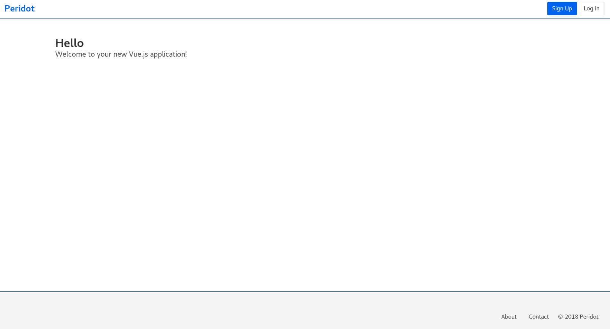

# Peridot
A fully featured Vue 2.6 PWA boilerplate


## Features:
* Progressive Web App (PWA) with Service Worker
* Code splitting and async component/route loading
* Automatic hot-reload in development
* Dockerized production setup with [pm2 load balancing](https://github.com/Unitech/pm2)
* Automatic removal of unused CSS/SCSS
* Global SCSS variables and easy theme customization
* Linting and formatting with [eslint](https://github.com/eslint/eslint) and [prettier](https://github.com/prettier/prettier)
* Uses [Buefy](https://buefy.github.io/#/) for styling


#### Coming Soon
* Email contact form with Sendgrid.

## Running
```bash
# Run in development
yarn run serve

# Building and running with Docker
docker build -t peridot .
docker run -p 8080:8080 peridot:latest

# Lint .vue, .js, .scss
yarn run lint
```

## Backend

Want a ready-to-go backend for this web app for user authentication and management, email verification and more? Check out [microAuth](https://github.com/gingernaut/microAuth), a Python Sanic boilerplate that works out of the box with this project.

## Contributing

Pull requests are welcome and appreciated!
